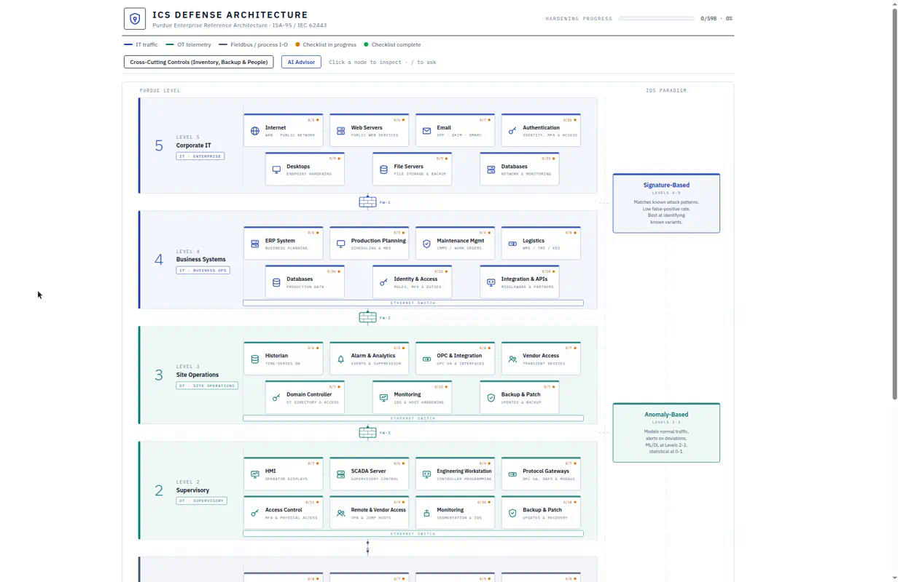
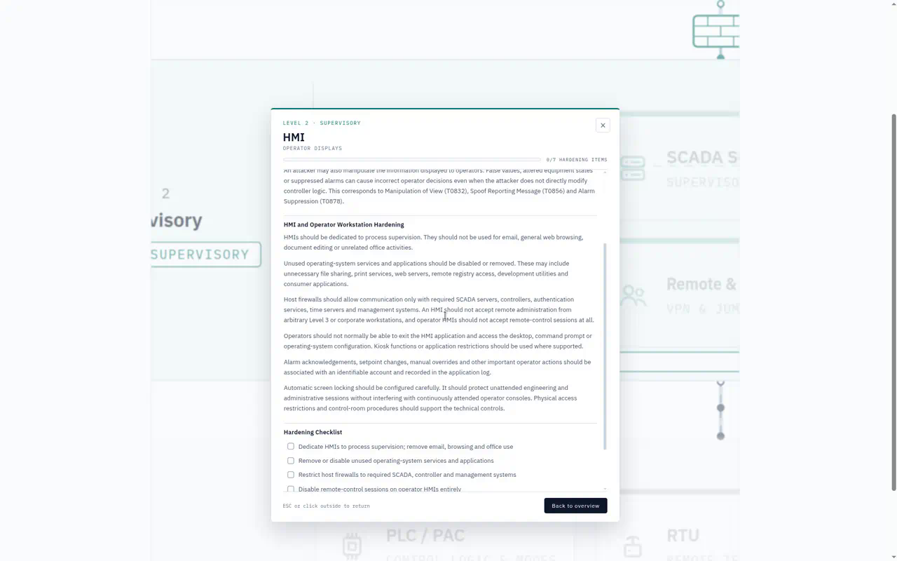
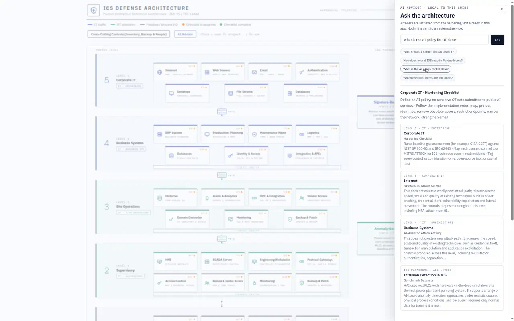

# ICS Defense Architecture

An interactive hardening guide for Industrial Control Systems. The app is a visual summary of the master’s thesis **A Defense Architecture for ICS Security**: the Purdue Model (Levels 5 through 0) as a working diagram, with a checklist for every control.

Click a level or a component to open cost-aware guidance aligned with NIST SP 800-82, IEC 62443 and MITRE ATT&CK for ICS. Progress is stored in the browser. A local AI advisor can point you at the right section of the guide without sending anything to an external service.



## What the app contains

- **Purdue diagram** — corporate IT through field devices, with firewalls, Ethernet switch bars, and animated flows between levels. The right-hand column maps IDS paradigms (signature, anomaly, specification, hybrid) onto those levels.
- **Hardening checklists** — every listed measure is checkable. Amber dots mean a node is in progress; green means it is complete. The header tracks site-wide progress.
- **Threat-informed notes** — techniques are tied to ATT&CK for ICS and to documented incidents (Stuxnet, Ukraine 2015, NotPetya, Colonial Pipeline, TRITON, PIPEDREAM).
- **AI Advisor** — ask about a level, a control, or which items are still open. Answers come only from the text already in the app.





## How to start it

You need [Node.js](https://nodejs.org/) installed (the LTS version is fine).

Open a terminal in the project folder and run:

```bash
npm install
npm run dev
```

When Vite is ready it prints a local URL. Open it in the browser:

**http://localhost:5173/**

On Windows, from this project’s folder, that looks like:

```bat
cd C:\Users\risto\Desktop\ics-defense-architecture
npm install
npm run dev
```

Leave the terminal open while you use the app. Stop the server with `Ctrl+C`.

The first `npm install` is only needed once (or after dependencies change). After that, `npm run dev` is enough.

### Production build

```bash
npm run build
npm run preview
```

`preview` serves the built files locally so you can check the production bundle.

## Using the app

1. Click a **level label** (for example Supervisory) or a **component** (for example HMI) to open its guidance.
2. Tick items on the hardening checklist. Progress is saved in this browser (`localStorage`).
3. Open **Cross-Cutting Controls** for inventory, backup and people measures that apply at every level.
4. Open **AI Advisor** (or press `/`) to search the guide. Nothing leaves the machine.

`Esc` or a click outside the panel returns to the diagram.

## Project structure

| File | Purpose |
|------|---------|
| `src/purdueModel.js` | Diagram data and geometry: levels, components, layout |
| `src/level5Content.js` … `src/level0Content.js` | Hardening guidance per Purdue level |
| `src/crossCuttingContent.js` | Controls that span all levels |
| `src/idsContent.js` | IDS paradigm notes |
| `src/App.jsx` | Diagram, zoom, checklist state, modal |
| `src/AiPanel.jsx` | Local advisor UI |
| `src/aiAdvisor.js` | Retrieval over the in-app text |

To add or edit guidance, change the relevant `level*Content.js` file. Content blocks support headings (`h`), paragraphs (`p`), checkable lists (`list`), plain lists (`list` + `plain: true`), code snippets (`code`) and resource links (`links`).
